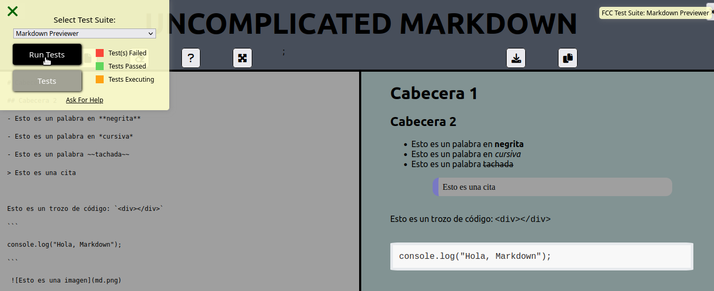

# An Easy Markdown Previewer


[](https://app.netlify.com/sites/easy-markdown/deploys) 

It is a web application that allows you to write Markdown in a simple way. While you are writting markdown you will be watching the the formated markdown code. It is a project for the FreeCodeCamp's Certification (FCC) on "Front End Development Libraries"

## Usage 
 
To use it you have to access this URL: [https://easy-markdown.netlify.app/](https://easy-markdown.netlify.app/)

## Installation

This is how to install this project to develop it

First of all, download it:

```bash
$ git clone https://github.com/JavierRibaldelRio/Proyects-FreeCodeCamp.git
```

Secondly, navigate to the markdown previewer directory

```bash 
$ cd /Proyects-FreeCodeCamp/Front-End-Development-Libraries/markdown-previewer
```

After that, install de node packpages using

```bash
$ npm install
```

Finally, to start the development server use:

```bash
$ npm start
```

## Running the tests

### FCC Tests

In the webpage in the top right corner you will f ind the test utility, to use it you have to select Markdown-Previewer an then press run tests.




--- 

## Built with

- [Fontawoesome](https://fontawesome.com/) - To get the icons for the web
-  [Marked-React](https://www.npmjs.com/package/marked-react) - To format markdown
-  [File-Saver](https://www.npmjs.com/package/file-saver) - To save the md file

## Author

[Javier Ribal del Río](https://github.com/JavierRibaldelRio)

## License

This project is licensed under the MIT License - see the [LICENSE](../../LICENSE) file for details

